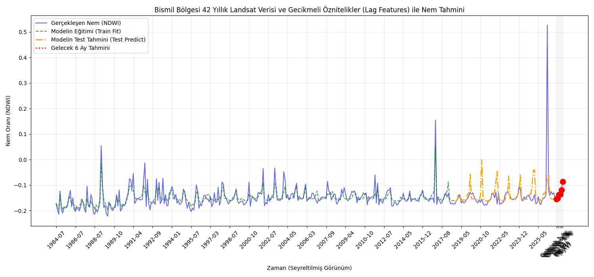
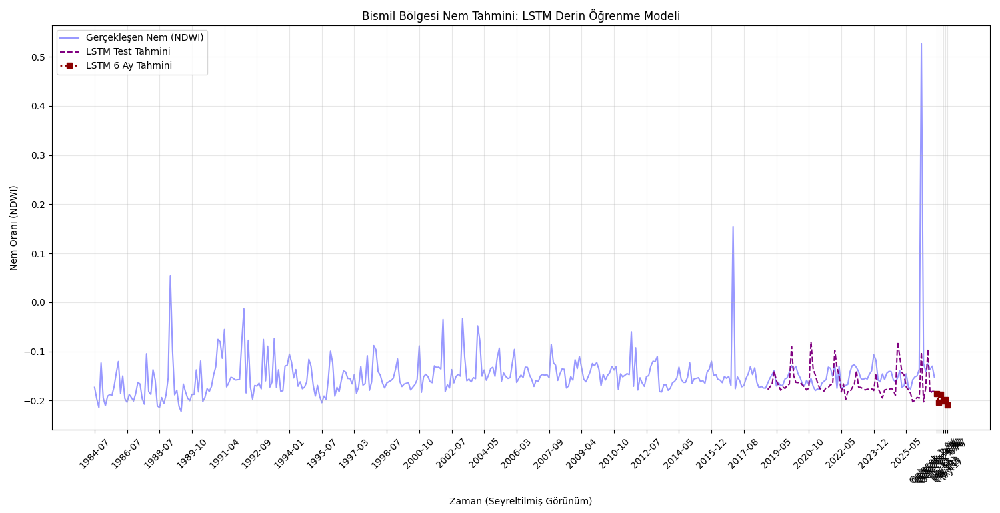

# 🛰️ Bismil Bölgesi Tarımsal Nem Analizi ve Tahmini (1984-2026)
*Bilecik Şeyh Edebali Üniversitesi - Bilgisayar Mühendisliği Staj Projesi*

[](https://www.python.org/)
[](https://tensorflow.org/)
[](https://scikit-learn.org/)
[](https://earthengine.google.com/)

---

## 🇹🇷 Türkçe Açıklama

Bu repo, Diyarbakır'ın Bismil ilçesindeki tarım arazilerinin 42 yıllık (1984–2026) uydu görüntüleri üzerinden toprak/bitki nem analizinin (NDWI) yapılması ve geleceğe dönük zaman serisi nem tahminlerinin Makine Öğrenmesi (Random Forest) ve Derin Öğrenme (LSTM) modelleriyle gerçekleştirilmesi amacıyla staj dönemi çalışması olarak geliştirilmiştir.

### 📁 Proje Dosyaları ve Yapısı
* `landsat_42_yillik_nem_verisi.csv`: Google Earth Engine üzerinden 42 yıllık süreç için derlenen ve eksik verileri interpolasyonla doldurulmuş ham/işlenmiş NDWI veri seti.
* `verileri2_indirme.py`: GEE arşivi üzerinden Landsat (L5, L7, L8, L9) ve Sentinel-2 verilerini tarayarak piksel bazlı bulut maskeleme ile nem indeksi çıkaran script.
* `nem_analizi.py`: Güncel tarih aralığında Bismil bölgesi için RGB ve NDWI haritaları üretip interaktif HTML olarak kaydeden betik.
* `bismil_nem_analizi.html`: Üretilen interaktif katmanlı GEE harita çıktısı.
* `nem_tahmini.py`: Kayarak pencere (sliding window) mimarisiyle geçmiş 3 ayın verilerini (`Lag_1`, `Lag_2`, `Lag_3`) öznitelik olarak ekleyen ve **Random Forest Regressor** modeliyle hiperparametre optimizasyonu yaparak 6 aylık zincirleme tahmin üreten script.
* `ltsm2.py`: Verileri ölçeklendirip 3 boyutlu tensor yapısına dönüştürerek **LSTM (Long Short-Term Memory)** derin öğrenme mimarisini eğiten ve gelecek 6 ayın tahminini gerçekleştiren script.

---

## 🇬🇧 English Description

This repository contains the code and documentation developed during my internship project focusing on 42-year (1984–2026) soil and vegetation moisture analysis (NDWI) using satellite imagery for agricultural lands in Bismil, Diyarbakır, alongside time-series moisture forecasting via Machine Learning (Random Forest) and Deep Learning (LSTM) models.

### 📁 Project Files & Structure
* `landsat_42_yillik_nem_verisi.csv`: The 42-year historical NDWI dataset collected via Google Earth Engine with linear interpolation for missing values.
* `verileri2_indirme.py`: Python script to fetch Landsat (L5, L7, L8, L9) & Sentinel-2 archives through GEE, applying pixel-level cloud masking.
* `nem_analizi.py`: Script generating RGB and NDWI moisture maps for the Bismil region and exporting them as an interactive HTML file.
* `bismil_nem_analizi.html`: Interactive layered GEE map output.
* `nem_tahmini.py`: Script implementing sliding window lag features (`Lag_1`, `Lag_2`, `Lag_3`) to train a **Random Forest Regressor** model, perform hyperparameter tuning, and forecast 6-month chained predictions.
* `ltsm2.py`: Script preprocessing data into 3D tensors to build and train an **LSTM (Long Short-Term Memory)** deep learning architecture for temporal moisture prediction.

---

## 📊 Model Sonuçları ve Çıktılar / Model Results & Outputs

### 🌲 Random Forest Model Sonuçları
```text
--- 42 YILLIK MODEL TEST SONUÇLARI ---
Test Verisi Ortalama Mutlak Hata (MAE): 0.0279
Test Verisi Hata Kareler Ortalamasının Kökü (RMSE): 0.0750
Model Başarı Skoru (R² Skoru): 0.0748

--- ÖNÜMÜZDEKİ 6 AYIN GERÇEKÇİ NEM TAHMİNLERİ ---
Gelecek 1. Ay Tahmini NDWI: -0.1542
Gelecek 2. Ay Tahmini NDWI: -0.1519
Gelecek 3. Ay Tahmini NDWI: -0.1371
Gelecek 4. Ay Tahmini NDWI: -0.1358
Gelecek 5. Ay Tahmini NDWI: -0.1199
Gelecek 6. Ay Tahmini NDWI: -0.0862
```
**Random Forest Tahmin Grafiği:**


---

### 🧠 LSTM Model Sonuçları
```text
--- LSTM MODELİ PERFORMANS METRİKLERİ ---
MAE  : 0.0346
RMSE : 0.0779
R²   : 0.0021

--- ÖNÜMÜZDEKİ 6 AYIN LSTM NEM TAHMİNLERİ ---
Gelecek 1. Ay Tahmini NDWI: -0.1853
Gelecek 2. Ay Tahmini NDWI: -0.2036
Gelecek 3. Ay Tahmini NDWI: -0.1878
Gelecek 4. Ay Tahmini NDWI: -0.2007
Gelecek 5. Ay Tahmini NDWI: -0.1986
Gelecek 6. Ay Tahmini NDWI: -0.2086
```
**LSTM Tahmin Grafiği:**


---

## 🚀 Kurulum & Çalıştırma / Installation & Usage

Gerekli kütüphaneleri yüklemek için terminalde aşağıdaki komutu çalıştırabilirsiniz / Run the following command to install dependencies:

```bash
pip install pandas numpy matplotlib scikit-learn tensorflow geemap earthengine-api
```
